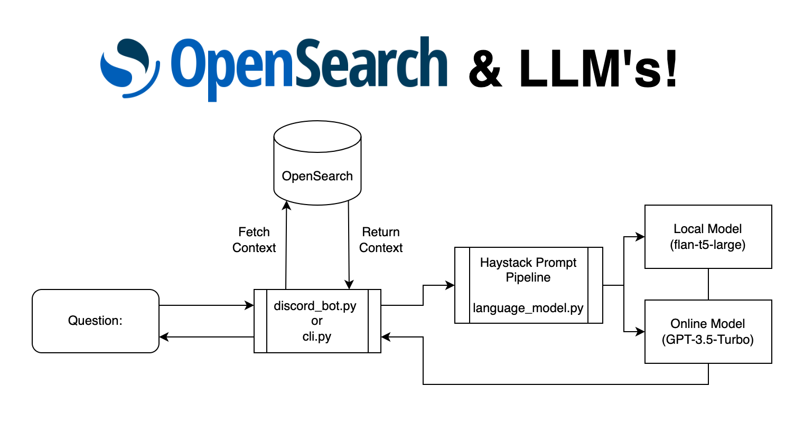

# OpenSearch Haystack Demo

Welcome to the OpenSearch Haystack Demo! Here we showcase how to use [OpenSearch](https://opensearch.org) as a context store for language models such as [flan](https://huggingface.co/google/flan-t5-large) and [ChatGPT](https://openai.com/blog/chatgpt). 

Here is how queries are handled in the project: 


This demo uses a discord bot or cli as an interface into an LM or LLM such as ChatGPT or Flan-T5. OpenSearch provides context that the language model might need to answer the question. There are many other ways this could be exposed such as with a rest api or integrated into your webpage. 

## 0. Setup
To get the project running you will need an already setup OpenSearch cluster. For the purposes of this demo you can run `docker compose up -d` to get a simple one node cluster for testing. 

Additionally, we need to install the prerequisiste python packages. These can be installed by running `python3 -m pip install -r requirments.txt` (If you are on an Arm based Mac you can run the m1-installer.sh as there are some other prerequisites). 

## 1. Ingesting Data

The first step to get the demo running is to ingest your data into OpenSearch. This step pulls any json documents from the `data` directory and ingests them into OpenSearch. The json documents need to be formatted as a list and have the context data stored in a field called `content` like the below sample: 

```json
# ./data/documents.json
[
  {
    "content": "The context you would like returned."
  },
  {
    "content": "..."
  },
]
```

Then run `python3 context-bot/cli.py -i` and it will scoop up all of the documents in the data directory into an index called `documents`. Once the data is ingested we can run the bot. 

## 2. Querying the model

To query the model you can run `python3 context-bot/cli.py -m flan -q "<Your Query Here>"`. Here model is the name of the language model you'd like to use. Right now we are configured for `flan` which runs flan-t5-large and `gpt` which is gpt-3.5-turbo. To run GPT you will need to put a `.env` file in the root of your repo with the following: 

```text
# .env file
OPEN_API_KEY=<open api key here>
```

You can get your OpenAPI key from [here](https://platform.openai.com/account/api-keys). Please note: with the way this project is currently configured queries will run an average of 3-4 cents per question.

## 3. Discord 

To start the Discord bot you will need a `.env` file with the following: 

```
DISCORD_TOKEN=<discord token here>
```

Then the bot can be run with `python3 contex-bot/discord_bot.py`. From your server you can then use either `!gpt <queston>` or `!flan <question>` to query the models. A more detailed guide on setting up discord bots is in the works. 